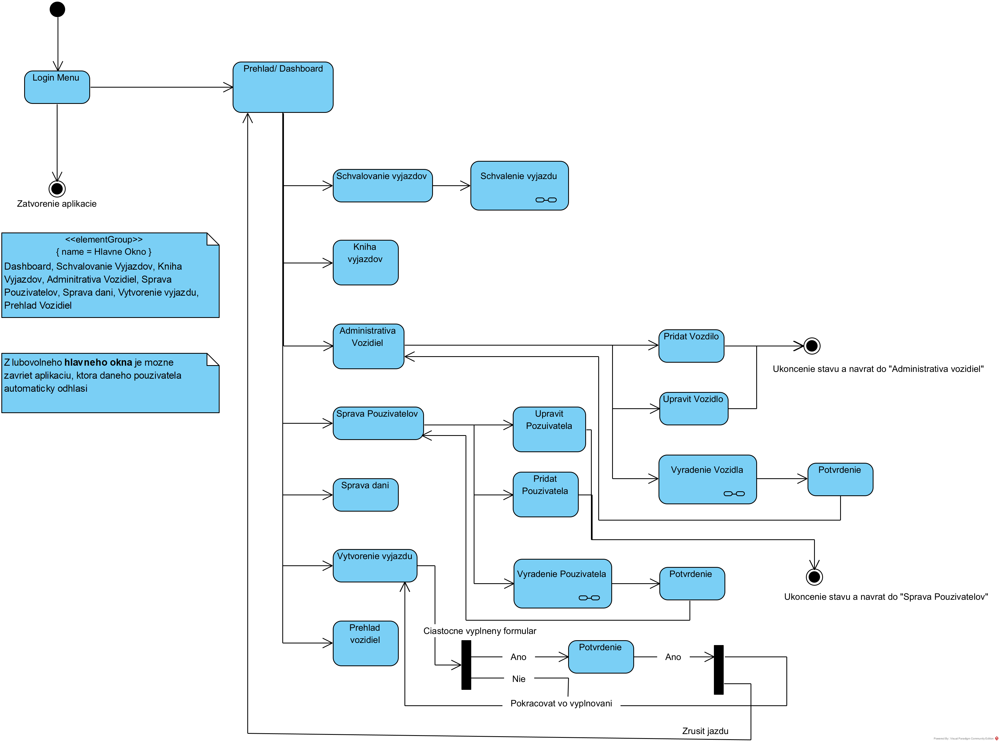
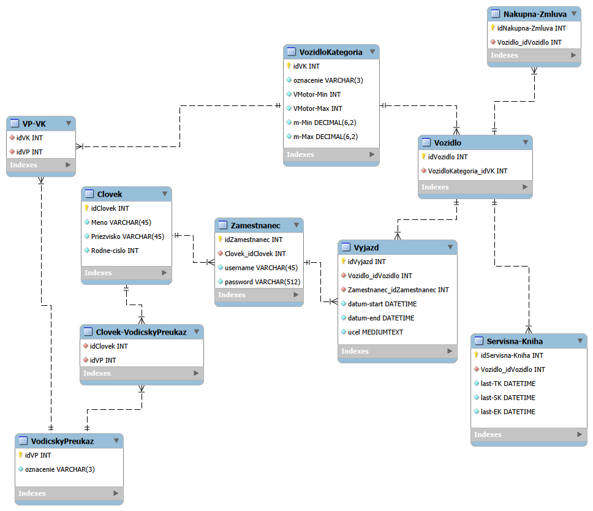

# eWheel
eWheel is a school project for course paz1c. It is a system for vehicle registration and managemnt coupled with dispatch logbook

This project was made in collaboration with @CaptainRepus (See authors for more information).

> [!IMPORTANT]
> Do 15.10.2026 Je potrebne:
> - Názov zadania, krátky opis zámeru a mená členov tímov je potrebné zaslať mailom cvičiacemu
> - Vyberte si technologické črty vášho projektu. Na úspešnú obhajobu projektu si vyberte črty v minimálnej sume 16 bodov, z ktorých musíte obhájiť aspoň 10 bodov.
> - [Tabulka tu](https://paz1c.ics.upjs.sk/tabulka-pozadovanych-bodov/)

## Navigation

To best describe our app and navigation we've prepared detailed diagram explaining navigation between stages/scenes

_author: Jakub Bendík_

### Pracovna verzia Navrhu Databazy (Zatial len kostra) - !NOT FINAL!

Navrh Databazy, toto je len pracovna verzia, mozno ocakavat zmeny, navrh db nbude mat na starosti pan kolega Lazorik ako projekt pre predmet Db1a+Paz1c

_author: Jakub Bendík_
